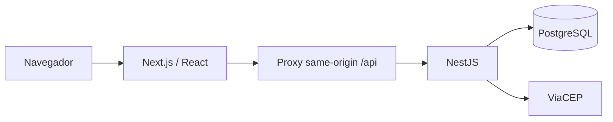

# HARU — relatório da migração para desenvolvimento

Data: 09/09/2026. Base: v5.5, revisão mais recente da v5 encontrada no repositório. Entrega: **migração do site existente para uma base executável**, conforme a prioridade de começar a trabalhar em código, visual e funcionalidades hoje.

## Objetivo e escopo

Preservar a identidade do Haru e remover a dependência de páginas e scripts globais como base de desenvolvimento. Separar interface, regras de negócio e persistência, com código TypeScript comentado, banco reproduzível e testes.

O escopo comercial completo do CSV permanece em [REQUIREMENTS.md](REQUIREMENTS.md). Mercado Pago, Correios, contas, painel, emissão fiscal e automações não fazem parte da prontidão desta primeira entrega. Não confundir migração técnica com loja pronta para vender.

## Isolamento

- Original: `Aeromorto/HaruSite`, somente referência.
- Fork público: `uzoom333/HaruSite-migration`.
- Branch: `migration/stack`.
- Local: `/home/uzoom/projetos/HaruSite-migration`.
- `origin` aponta ao fork; push de `upstream` bloqueado localmente.
- Banco exclusivo na porta 55439; testes em banco separado com sufixo `_test`.
- Nenhum dado comercial, credencial ou alteração do original foi importado/publicado.

## Tecnologias utilizadas

Versões resolvidas nesta entrega; instalação reproduzível pelo `package-lock.json` com `npm ci`.

| Tecnologia | Versão | Uso |
| --- | --- | --- |
| Next.js | 16.3.4 | Rotas, renderização inicial, metadados e proxy HTTP do frontend. |
| React / React DOM | 19.3.0 | Componentes, estado e eventos da interface. |
| TypeScript | 5.9.3 | Tipagem estrita nos dois aplicativos e contratos compartilhados. |
| NestJS | 11.2.3 | API, injeção de dependências, controllers e validação. |
| Tailwind CSS | 4.3.3 | Layout e utilitários visuais. |
| daisyUI | 5.7.32 | Controles com prefixo `ui-`, sem colisões com o design original. |
| PostgreSQL | 14.23 local / 16 no Compose e CI | Catálogo, variações, sessões e itens da sacola. |
| node-postgres (`pg`) | 8.23.0 | Pool, SQL parametrizado e transações. |
| class-validator / class-transformer | 0.14.4 / 0.5.1 | DTOs estritos e rejeição de campos indevidos. |
| Helmet / cookie-parser | 8.3.0 / 1.4.7 | Cabeçalhos HTTP e leitura de cookies. |
| NestJS Throttler | 6.5.0 | Limite básico de requisições. |
| Playwright | 1.63.0 | Fluxos no Chromium desktop e viewport mobile. |
| Node test / Supertest | Node 24 local / Supertest 7.2.2 | Regressão e integração HTTP com banco real. |
| Prettier | 3.9.6 | Formatação para leitura e correção humana. |

SQL explícito foi escolhido para manter as primeiras tabelas e transações fáceis de inspecionar. Não há Prisma, TypeORM ou MongoDB nesta entrega. Os contratos TypeScript são compartilhados; a validação de entradas acontece efetivamente na API, não apenas na tipagem.

## Arquitetura



- `apps/web`: páginas, conteúdo, controles, sacola e estilos.
- `apps/api`: catálogo, sacola, CEP, validação e conexão SQL.
- `packages/contracts`: tipos usados pelos dois aplicativos.
- `scripts`: migração inicial do conteúdo e preparação do banco local.
- `tests`: legado preservado e testes de navegador.

As páginas são componentes TSX reais. Não se usa iframe, HTML injetado ou execução dos scripts globais antigos. `scripts/convert-v55.cjs` foi uma ferramenta de conversão inicial dos arquivos próprios; ela recusa sobrescrever componentes existentes sem `--overwrite`. O trabalho humano daqui para frente deve ocorrer nos TSX, não reexecutando o conversor.

## Páginas migradas

| Antes | Agora | Situação |
| --- | --- | --- |
| `index.html` | `/` | Hero, coleção, marca, valores, matéria, cartas e contato. |
| `escova.html` | `/escova` | Galeria, informações, preço da API e sacola. |
| `kit.html` | `/kit` | Galeria, informações, preço da API e sacola. |
| `suporte.html` | `/suporte` | Galeria, informações, preço da API e sacola. |
| `microplasticos.html` | `/microplasticos` | Conteúdo editorial e imagens preservados. |
| `uso.html` | `/uso` | Notas de uso/FAQ preservadas. |
| `privacidade.html` | `/privacidade` | Conteúdo atualizado para explicar a nova persistência técnica. |
| `termos.html` | `/termos` | Conteúdo legado preservado nesta fase. |
| Link de alterações | `/migracao` | Situação resumida da versão e acesso ao fork. |

URLs `.html` da raiz e de `/v5.5/` redirecionam para as rotas equivalentes. A página histórica detalhada `v5.5/changes/index.html` permanece no legado; não foi reproduzida como changelog completo no aplicativo novo.

## Mudanças funcionais

### Catálogo e preços

Os três produtos passaram a existir no PostgreSQL: escova (4800 centavos), kit (8600) e suporte (6200). Fotos e preços vêm do catálogo da API; descrições traduzidas permanecem no conteúdo editorial versionado. Filtro por preço máximo, ordenação crescente/decrescente e limpeza do filtro foram acrescentados.

A estrutura separa produto de SKU para permitir evolução posterior. Apenas o SKU inicial existe para cada produto. Estoque é `NULL` porque nenhum saldo comercial foi fornecido. Mantém-se provisoriamente o limite de nove unidades da v5.5; se o saldo for informado, a API passa a respeitá-lo, com teto operacional 99. Não existe reserva ou baixa de estoque.

### Sacola

Saiu do localStorage e passou a usar PostgreSQL, identificada por cookie anônimo HttpOnly. Quantidades, preços e subtotal são validados/calculados no servidor. A UI bloqueia cliques durante a mutação, descarta leituras antigas e revalida ao voltar à aba. Transações serializam escritas por sacola.

A sessão permanece no mesmo navegador por até 30 dias. Não existe sincronização entre aparelhos nem login. A sacola das versões antigas não é importada. Falhas da API são exibidas com opção de tentar novamente; alterações não confirmadas não são anunciadas como salvas.

### CEP e frete

Consulta de endereço passou pela API NestJS, com host fixo, validação, timeout e tratamento de CEP inexistente. A interface cancela a requisição anterior ao editar o campo. **Valores e prazos ilustrativos de PAC/SEDEX foram retirados.** A consulta mostra cidade/UF e informa que a cotação depende da integração dos Correios.

### Newsletter e checkout

O formulário de e-mail continua local, sem inscrição ou envio. Foi acrescentada exclusão do e-mail salvo neste aparelho. Não se migrou uma simulação para um serviço de envio inexistente.

O botão do produto passou a dizer “Ver sacola”. “Continuar” na sacola explica que nenhum pedido ou pagamento foi realizado. Logotipos de meios de pagamento do conteúdo original permanecem como apresentação, acompanhados de aviso de compras em preparação. Não há pedido, gateway ou autenticação fictícios.

## Melhorias visuais e de interação

- Preservadas fotos, tipografia local, paleta oliva, espaços editoriais e temas clara/kraft.
- Cabeçalho e rodapé compartilhados, em vez de duplicação por página.
- Navegação interna com Next Link, mantendo estado da interface.
- Controles Tailwind/daisyUI harmonizados com o visual original.
- Camada CSS própria para o legado, evitando que resets antigos anulem os controles novos.
- Filtro e ordenação responsivos; áreas de interação maiores.
- Sacola em dialog nativo: foco contido, Escape, bloqueio do fundo e retorno de foco do navegador.
- Estados de carregamento/erro, avisos acessíveis, 404 e recuperação de erro de página.
- Idiomas e temas persistidos em chaves específicas da migração; atributos e títulos atualizados.
- Scroll suave nativo e preferência por movimento reduzido. A animação cinematográfica/pin do hero com GSAP/Lenis não foi portada; o hero foi preservado visualmente em apresentação estática, com menos dependências e sem captura da rolagem. Pode ser redesenhado na próxima etapa visual.

## Banco e segurança técnica

Migração `001_catalog_cart.sql`: `products`, `variants`, `carts`, `cart_items`; controle em `schema_migrations`. Migrações explícitas, transacionais e protegidas contra execução simultânea; sem sincronização automática de schema na API.

Consultas parametrizadas; valores em centavos; chaves estrangeiras e checks; segredo de sessão aleatório de 256 bits, armazenado como hash no banco; cookie HttpOnly/SameSite; validação de Origin e header customizado nas mutações; Helmet e throttling básico.

Não há endpoints administrativos públicos de escrita. Para inserir produtos/estoque, a próxima etapa deve definir administração e validações próprias. O ambiente local usa autenticação trust restrita ao loopback e **não é configuração de produção**. O Compose fornece outra opção de banco de desenvolvimento. Dados e `.env` são ignorados pelo Git.

Limitações a resolver para hospedagem: HTTPS/cookie Secure, proxy confiável, limitação distribuída, limpeza de sessões expiradas, backup/restauração e observabilidade. Consulte [API.md](API.md).

## Como executar e editar

Os comandos completos estão no [README](../README.md). Fluxo local: instalar dependências → copiar `.env.example` → iniciar banco → aplicar migrações → `npm run dev` → `http://localhost:3000`.

Para manutenção humana:

1. Layout global: `site-shell.tsx`; refinamentos CSS: `globals.css`.
2. Página: rota em `app/`, corpo em `content/`, textos no dicionário.
3. Regra da sacola: `cart.service.ts`; contrato: `packages/contracts`.
4. Mudança de banco: nova migração SQL; nunca modificar silenciosamente SQL já aplicado.
5. Rodar typecheck e testes pertinentes; atualizar este relatório ao concluir a mudança.

Comentários explicam decisões, invariantes, transações, limites e falhas. Não foram adicionados comentários repetitivos para cada linha de markup, pois isso atrapalharia a edição do conteúdo.

## Verificação desta entrega

- TypeScript: frontend e API sem erros.
- Build de produção: Next.js e NestJS compilados.
- 14 testes legados preservados.
- 5 testes de API/serviços: catálogo, persistência e isolamento de sacolas, validação, estoque e consulta de CEP.
- 8 testes de navegador: quatro cenários em desktop e quatro em viewport mobile, usando Chromium e banco real de testes.
- Inspeção de capturas desktop/mobile para conferir identidade visual.

Os testes de CEP usam respostas controladas para simular sucesso/erro/timeout e corrida; não certificam a disponibilidade externa contínua do ViaCEP. A suíte mobile usa emulação Chromium, não um dispositivo físico Safari. CI foi configurado para repetir as verificações no fork; execução remota deve ser conferida no GitHub após o push.

## O que fica para as próximas entregas

A base está pronta para desenvolvimento de código e visual. Continuam pendentes: escolha de atributos e saldos reais, seletor de variações, compras/estoque transacional, Mercado Pago, Correios, login opcional, painel e permissões, cupons, relatórios, e-mails, emissão fiscal, automações e hospedagem pública. O CSV orienta essas entregas sem expandir a promessa desta migração inicial.

## Referências técnicas consultadas

- [Next.js — instalação e App Router](https://nextjs.org/docs/app/getting-started/installation)
- [NestJS — validação](https://docs.nestjs.com/techniques/validation)
- [NestJS — rate limiting](https://docs.nestjs.com/security/rate-limiting)
- [node-postgres — transações](https://node-postgres.com/features/transactions)
- [daisyUI — Next.js](https://daisyui.com/docs/install/nextjs/)

## Pausa solicitada pelo usuário — limite de tokens

Trabalho interrompido a pedido do usuário. Arquivos salvos localmente, mas esta implementação ainda não foi commitada nem enviada ao fork.

Último estado verificado: 14 testes legados, 5 testes de API e 8 testes de navegador passaram antes dos últimos ajustes. Depois foram alterados camadas CSS, links internos, proteção contra leituras antigas e inicialização do Next com o `.env` da raiz. Typecheck passou após links/estado; o build final foi iniciado, mas seu resultado não foi conferido antes desta pausa.

Retomar sem refazer a migração: conferir o build final, repetir os testes de navegador por causa dos últimos ajustes visuais, iniciar `npm run dev`, conferir a interface e só então commitar/publicar exclusivamente na branch `migration/stack` do fork. O PostgreSQL local pode continuar ativo na porta 55439. Nenhuma alteração foi feita no repositório original.

## Publicação do estado atual no fork

Publicação solicitada pelo usuário para colaboração. O build final gerou `apps/web/.next/BUILD_ID`; a suíte de navegador ainda precisa ser repetida para os últimos ajustes. As capturas em `docs/preview/` mostram a interface na última rodada de testes, anterior aos refinamentos finais de CSS. São prévias estáticas, não uma aplicação hospedada. A nota anterior sobre ausência de commit/push descreve o momento da pausa e é substituída por esta publicação.

## Troca do PostgreSQL por SQLite (rumo ao Cloudflare D1)

Decisão do usuário em 14/09/2026: abandonar o PostgreSQL e adotar SQLite, com o
Cloudflare D1 como destino. Caminho escolhido: **SQLite local primeiro**, via
`node:sqlite` (embutido no Node 22.5+/24, sem dependência nova), escrevendo o SQL
no dialeto que o D1 aceita. Assim a troca posterior de driver não reescreve consultas.

Alternativas descartadas nesta etapa: falar com o D1 por HTTP desde já (exige conta,
token e paga latência de rede por consulta em desenvolvimento) e mover a API para um
Worker do Cloudflare (o NestJS não roda nesse ambiente; seria reescrita da API).

### Consequência de arquitetura: sem transação interativa

O D1 não oferece `BEGIN`/`COMMIT` entre requisições — apenas `batch()` atômico, sem
ler resultado no meio para ramificar. Todo trecho que hoje faz ler → decidir → gravar
precisa virar uma única instrução cujo `WHERE` carrega a regra, conferindo `changes()`
depois. Para a baixa de estoque o padrão é:

```sql
UPDATE variants SET stock = stock - ?1 WHERE sku = ?2 AND stock >= ?1;
```

Isso é mais correto que ler e depois gravar, porque não existe janela entre a
verificação e a escrita. O `SELECT ... FOR UPDATE` do Postgres também deixa de ser
necessário: o SQLite admite um único escritor por banco e já serializa.

### Concluído e verificado

- `.env`/`.env.example`: `DATABASE_URL` e `TEST_DATABASE_URL` deram lugar a
  `DATABASE_FILE` e `TEST_DATABASE_FILE`. Os caminhos são relativos à raiz do
  repositório e precisam ser resolvidos contra ela, porque a API executa com o
  diretório de trabalho em `apps/api`; abrir o caminho direto cria um banco vazio
  paralelo em `apps/api/.local/`.
- `001_catalog_cart.sql` reescrito no lugar, em dialeto SQLite. Não houve
  modificação de SQL já aplicado: nenhum banco SQLite existia antes desta etapa.
  O histórico de migrações recomeça com o novo motor.
- `002_orders_stock.sql` acrescentada: `orders`, `order_items`, `stock_movements`.
  Restrições conferidas uma a uma em banco descartável — total divergente do
  somatório, status fora da lista, `line_total` diferente de preço × quantidade,
  delta zero e motivo inválido são todos recusados pelo banco.
- `scripts/migrate.cjs` migrado para `node:sqlite`. Lock consultivo removido.
  Dois defeitos herdados da versão PostgreSQL foram corrigidos: o `ROLLBACK` do
  bloco de erro substituía a causa real quando a falha ocorria antes de a transação
  abrir, e o tratador final descartava o objeto de erro, tornando falha de dialeto
  indistinguível de falha de caminho.
- Migração aplicada e idempotente na segunda execução; `typecheck` passa.

### Banco fictício para treino de consulta

`scripts/semear-vendas-ficticias.cjs` popula `.local/haru_ficticio.db` com pedidos
**inventados**, em gerador determinístico, para exercitar consulta analítica
(RF18, RF21, RF25) antes de existir venda real. O script recusa executar se
`DATABASE_FILE` ou `TEST_DATABASE_FILE` apontarem para esse arquivo. Esses dados
não representam operação do Haru e nenhuma tela os lê.
`scripts/consultas.sql` reúne as consultas de relatório e `scripts/consultar.cjs`
as executa. Somente `receita-por-mes` está escrita; as demais são exercícios abertos.

### Pendente nesta troca

1. `src/database.service.ts`: substituir o `Pool` do `pg` por `node:sqlite`,
   espelhando a forma do D1 (`all`/`first`/`run`). **A API não sobe até isso.**
2. `src/catalog.service.ts`: `$1` para `?1`, `LEAST` para `MIN`, remover `::integer`,
   `active = true` para `active = 1`.
3. `src/cart.service.ts`: eliminar a transação interativa conforme a seção acima.
4. `test/store.test.cjs` e `playwright.config.ts`: a validação do sufixo `_test`
   usa `new URL()`, que não se aplica a caminho de arquivo.
5. `apps/api/package.json`: remover `pg` e `@types/pg`.
6. `.github/workflows/pages.yml`: remover o serviço PostgreSQL.
7. README e AGENTS.md: as instruções de `npm run db:local` e Docker Compose
   descrevem o PostgreSQL e ficaram incorretas. Reescrever depois dos itens 1 a 3,
   quando os comandos pararem de mudar.

Decidir a estrutura de cupom, cadastro de cliente e emissão fiscal continua fora
desta etapa: são regras comerciais pendentes no CSV, não estrutura ditada pelo domínio.

### Implementação concluída em 14/09/2026

`database.service.ts` reescrito sobre `node:sqlite`, expondo `all`/`first`/`run`.
Três pragmas na abertura: `foreign_keys = ON` (o SQLite não valida por padrão, o D1
valida), `journal_mode = WAL` (leitura não espera a escrita) e `busy_timeout = 5000`
(esperar em vez de falhar no primeiro conflito de escrita). O caminho do banco é
resolvido contra a raiz do repositório, igual ao `migrate.cjs`.

`catalog.service.ts`: `$1` virou `?`, `LEAST` virou `MIN`, `::integer` removido,
`active = true` virou `active = 1`.

`cart.service.ts`: a transação interativa foi eliminada. A regra de estoque passou
para o `WHERE` da própria escrita e o resultado se lê em `changes`:

```sql
INSERT INTO cart_items(cart_id, sku, quantity)
SELECT ?, v.sku, ? FROM variants v JOIN products p ON p.id = v.product_id
WHERE v.sku = ? AND p.active = 1 AND ? <= MIN(COALESCE(v.stock, 9), 99)
ON CONFLICT(cart_id, sku) DO UPDATE SET quantity = excluded.quantity;
```

A leitura que escolhe a mensagem de erro acontece depois e fora de qualquer
transação: ela não participa da decisão, apenas distingue produto inativo de
quantidade acima do limite.

`app.module.ts`: o `/api/health` deixou de usar o pool. `pg` e `@types/pg` removidos.

Verificado com a API em execução: `/api/health`, `/api/products`, `/api/products/:slug`
e 404 para slug inexistente; na sacola, aceitar quantidade válida, recusar 50 quando
o limite é 9, recusar SKU inexistente, atualizar quantidade sem duplicar linha e
remover item com quantidade zero. O site em `localhost:3000` renderiza as páginas de
produto e o proxy do Next entrega catálogo e sacola.

Duas suposições anteriores foram desmentidas na prática: as linhas com protótipo nulo
do `node:sqlite` funcionam com espalhamento e `JSON.stringify` sem cópia, e `changes`
chega como número em execução — a conversão com `Number()` permanece apenas porque o
tipo declarado é `number | bigint`.

Pendências desta troca, atualizadas: restam os testes (`store.test.cjs` ainda importa
`pg`, que não está mais instalado, e a validação do sufixo `_test` usa `new URL()` em
caminho de arquivo), o `playwright.config.ts`, o workflow do GitHub e a reescrita do
README e do AGENTS.md.

### Pendências da troca encerradas em 14/09/2026

`apps/api/test/store.test.cjs` passou a usar `node:sqlite`. A validação do banco de
testes deixou de usar `new URL()` — agora exige nome terminado em `_test.db` e recusa
apontar para o banco de desenvolvimento. O arquivo é apagado antes de cada execução,
incluindo os companheiros `-wal` e `-shm` do journal, para que nenhum resultado dependa
da rodada anterior.

`playwright.config.ts` passou a exigir `TEST_DATABASE_FILE` e a repassar `DATABASE_FILE`
aos servidores de teste.

O workflow perdeu o serviço PostgreSQL: não há banco a subir nem verificação de saúde a
esperar. O Node subiu para 24.

Removidos por terem virado ferramental morto: `compose.yaml`, `scripts/setup-local-db.cjs`
(importava `pg`, que não está mais instalado) e `scripts/docker-test-db.sql`. O script
`db:local` saiu do `package.json`. README, AGENTS.md, API.md e REQUIREMENTS.md foram
reescritos para descrever o banco em arquivo.

Verificação completa após as mudanças: 14 testes legados, 5 da API e 8 de navegador
(desktop e mobile) passando, com `typecheck` e `build` limpos. A troca de motor está
encerrada; o que resta do projeto são as etapas de produto descritas em `REQUIREMENTS.md`.
